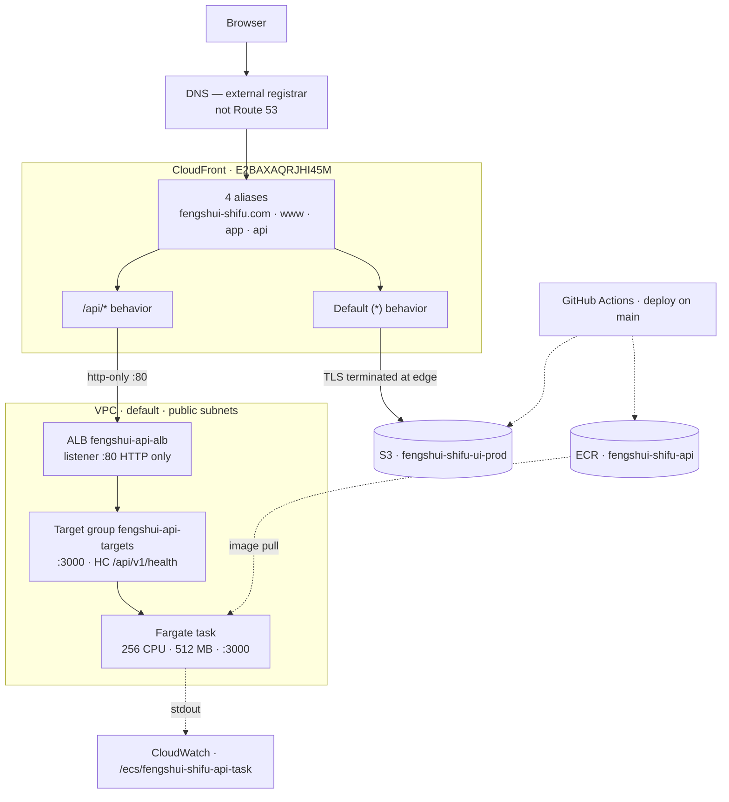

# AWS Infrastructure (Legacy — Retired Sept 2026)

**This documents the original AWS deployment that ran from August 2026 to September 2026. It has been retired and replaced with Render. Kept for historical reference.**

Production topology for both repos, in one place. The UI and the API deployed
separately but shared a single front door, so neither sub-repo's README could
describe the whole picture.

**Surveyed 2026-08-31** against account `125248801795`, region `us-east-1`.
Every figure here was read from the AWS API.

## Why this file exists

None of the production infrastructure was defined in code. There was no
Terraform, no CloudFormation, no CDK. Every resource below was created by hand
in the AWS Console on **2026-08-13** — CloudTrail showed 15 `UpdateDistribution`
calls that evening, all from a browser.

That means the *only* machine-readable record of how this was built was
CloudTrail, which retains management events for **90 days**. That history
expired around **2026-11-11**. This document is the final record.

## Topology

## The request path

One public entry point served both the app and the API. There was **no API
Gateway** — CloudFront did the path routing.

| Hop | What it did |
|---|---|
| CloudFront | Terminated HTTPS, served the UI from cache, forwarded `/api/*` onward |
| ALB | One stable address that survived container restarts; routed only to healthy targets |
| Target group | Held the current task IP and port; ECS registered/deregistered automatically |
| ECS | Decided *what* ran — image, count, restart policy |
| Fargate | Actually ran the container; no host to manage or SSH into |

Because both behaviours lived on the same distribution, **the hostname was
irrelevant to routing — only the path mattered.** `app.fengshui-shifu.com/api/v1/health`
and `api.fengshui-shifu.com/api/v1/health` both returned 200. The `api.`
subdomain was cosmetic.

## Resource inventory

| Resource | Identifier |
|---|---|
| CloudFront distribution | `E2BAXAQRJHI45M` |
| — aliases | `fengshui-shifu.com`, `www.`, `app.`, `api.` |
| — default root object | `index.html` |
| S3 (UI bundle) | `fengshui-shifu-ui-prod` |
| ALB | `fengshui-api-alb` — internet-facing, **listener `:80` HTTP only** |
| Target group | `fengshui-api-targets` — port 3000, target type `ip` |
| — health check | `GET /api/v1/health` · 30s interval · 5s timeout · expects `200` |
| — thresholds | 5 passes → healthy, 2 fails → unhealthy |
| — deregistration delay | 300s |
| ECS cluster / service | `fengshui-shifu-cluster` / `fengshui-shifu-api-task` |
| Task definition | `fengshui-shifu-api-task:4` — 256 CPU, 512 MB, Fargate |
| ECR | `fengshui-shifu-api` |
| Log group | `/ecs/fengshui-shifu-api-task` |
| Route 53 | **No zone for this project.** DNS was at an external registrar. |

## Load-bearing configuration

These settings broke production if changed. They were not obvious from the console.

### CloudFront behaviours — order mattered

| Precedence | Path | Origin | Methods | Cache policy |
|---|---|---|---|---|
| 0 | `/api/*` | ALB | all 7 | `Managed-CachingDisabled` |
| 1 | `Default (*)` | S3 | GET, HEAD | `Managed-CachingOptimized` |

CloudFront used the **first** matching pattern. If `/api/*` ever lost its
precedence, every API call fell through to S3 and 404'd on a route that looked
correctly configured.

**`CachingDisabled` on `/api/*` was a correctness requirement, not a
preference.** `today_luck_teaser` was randomised per request and BaZi results were
per-user. POST protection kept this safe then, but any `GET` endpoint returning 
user-specific data would have leaked across users without this policy.

The `/api/*` origin request policy was `Managed-AllViewer` (forwards all headers,
cookies, and query strings).

### Container port was 3000, everywhere

The container ran as non-root and could not bind ports below 1024. The ALB's
public port and the container port were independent.

### Health check timing

5 healthy checks × 30s interval = **150 seconds minimum** before a new task
received traffic. The service's `healthCheckGracePeriodSeconds` had to exceed
that or ECS killed tasks mid-boot.

## Known traps

- **The `/api/*` origin ID was `ec2-54-167-98-185.compute-1.amazonaws.com`** — a
  fossil from before the ALB existed. Its actual domain was the load balancer.
  The label was misleading; routing was correct.
- **CloudFront → ALB was unencrypted.** The origin protocol policy was
  `http-only` on port 80. Users got valid HTTPS because CloudFront terminated
  TLS; the edge-to-origin hop crossed the internet in the clear. Fixing this
  would have needed an ACM certificate and a `:443` listener on the ALB.
- **`ALLOWED_ORIGINS` was set on the task definition but read by no code**, and
  its value did not match the real frontend origin. Wiring it up as-is would
  have broken the site.
- **`SECRET_KEY_BASE` was a plaintext `environment` entry**, not a `secrets`
  reference to Secrets Manager. Not exposed outside the account, but visible to
  anyone who could describe the task definition.
- **A browser CORS error here was usually not CORS.** ALB 5xx pages carried no
  `Access-Control-Allow-Origin` header. Debugging started with
  `curl -i https://api.fengshui-shifu.com/api/v1/health`.
- **Console work was done as `root`.** Should have been an IAM user with MFA.

## Operating cost

August 2026, unblended:

| Usage type | What it is | Cost |
|---|---|---:|
| `LoadBalancerUsage` | ALB, hourly regardless of traffic | $9.09 |
| `PublicIPv4:InUseAddress` | 3 addresses — 2 ALB ENIs + 1 task | $6.21 |
| `Fargate-vCPU-Hours` | 256 CPU units | $4.15 |
| Route 53 | 2 zones, both for an unrelated legacy project | $1.01 |
| `Fargate-GB-Hours` | 512 MB | $0.91 |
| ECR | 2.04 GB of layers | $0.06 |
| S3 | UI bundle | $0.04 |
| CloudFront · SES · Secrets Manager | Below billing threshold | $0.00 |
| **Total** | | **$21.48** |

**Why we left:** The $15/mo ALB charge was higher than the $5 of compute it balanced. Seven hand-configured services with no infrastructure-as-code. A weeks-long outage in Aug 2026 was caused by two target groups silently disagreeing about which one the listener pointed at. Render collapses this to two services and a `render.yaml` per repo, at roughly a third of the cost.
