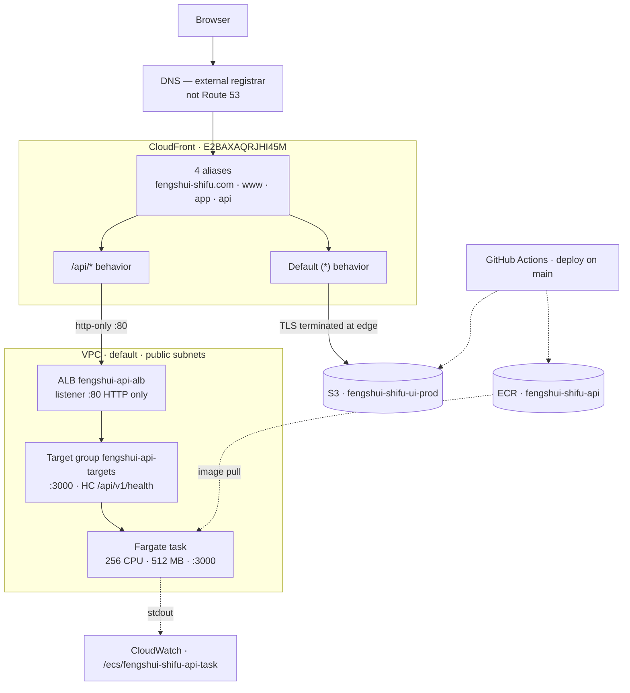

# Infrastructure

Production topology for both repos, in one place. The UI and the API deploy
separately but share a single front door, so neither sub-repo's README can
describe the whole picture.

**Surveyed 2026-08-31** against account `125248801795`, region `us-east-1`.
Every figure here was read from the AWS API — see
[Regenerating this document](#regenerating-this-document) to refresh it.

## Why this file exists

None of the production infrastructure is defined in code. There is no
Terraform, no CloudFormation, no CDK. Every resource below was created by hand
in the AWS Console on **2026-08-13** — CloudTrail shows 15 `UpdateDistribution`
calls that evening, all from a browser.

That means the *only* machine-readable record of how this was built is
CloudTrail, which retains management events for **90 days**. That history
expires around **2026-11-11**. After that, this document is the record.

If you rebuild any of it, update this file in the same change.

## Topology



## The request path

One public entry point serves both the app and the API. There is **no API
Gateway** — CloudFront does the path routing.

| Hop | What it does here |
|---|---|
| CloudFront | Terminates HTTPS, serves the UI from cache, forwards `/api/*` onward |
| ALB | One stable address that survives container restarts; routes only to healthy targets |
| Target group | Holds the current task IP and port; ECS registers/deregisters automatically |
| ECS | Decides *what* runs — image, count, restart policy |
| Fargate | Actually runs the container; no host to manage or SSH into |

Because both behaviours live on the same distribution, **the hostname is
irrelevant to routing — only the path matters.** `app.fengshui-shifu.com/api/v1/health`
and `api.fengshui-shifu.com/api/v1/health` both return 200. The `api.`
subdomain is cosmetic.

## Resource inventory

| Resource | Identifier |
|---|---|
| CloudFront distribution | `E2BAXAQRJHI45M` |
| — aliases | `fengshui-shifu.com`, `www.`, `app.`, `api.` |
| — default root object | `index.html` |
| S3 (UI bundle) | `fengshui-shifu-ui-prod` |
| ALB | `fengshui-api-alb` — internet-facing, **listener `:80` HTTP only** |
| Target group | `fengshui-api-targets` — port 3000, target type `ip` |
| — health check | `GET /api/v1/health` · 30s interval · 5s timeout · expects `200` |
| — thresholds | 5 passes → healthy, 2 fails → unhealthy |
| — deregistration delay | 300s |
| ECS cluster / service | `fengshui-shifu-cluster` / `fengshui-shifu-api-task` |
| Task definition | `fengshui-shifu-api-task:4` — 256 CPU, 512 MB, Fargate |
| ECR | `fengshui-shifu-api` |
| Log group | `/ecs/fengshui-shifu-api-task` |
| Route 53 | **No zone for this project.** DNS is at an external registrar. |

## Load-bearing configuration

Changing any of these breaks production. They are not obvious from the console.

### CloudFront behaviours — order matters

| Precedence | Path | Origin | Methods | Cache policy |
|---|---|---|---|---|
| 0 | `/api/*` | ALB | all 7 | `Managed-CachingDisabled` |
| 1 | `Default (*)` | S3 | GET, HEAD | `Managed-CachingOptimized` |

CloudFront uses the **first** matching pattern. If `/api/*` ever loses its
precedence, every API call falls through to S3 and 404s on a route that looks
correctly configured.

**`CachingDisabled` on `/api/*` is a correctness requirement, not a
preference.** `today_luck_teaser` is randomised per request and BaZi results are
per-user. Today you are also protected by `/bazi/calculate` being a POST, which
CloudFront never caches — but the moment a `GET` endpoint returns user-specific
data, this policy is the only thing preventing one user's chart being served to
everyone.

The `/api/*` origin request policy is `Managed-AllViewer` (forwards all headers,
cookies, and query strings).

### Container port is 3000, everywhere

See the **Port 3000 everywhere** section in
[`../CLAUDE.md`](../CLAUDE.md) for the full history. Short version: the
container runs as non-root and cannot bind ports below 1024. The ALB's public
port and the container port are independent.

### Health check timing

5 healthy checks × 30s interval = **150 seconds minimum** before a new task
receives traffic. The service's `healthCheckGracePeriodSeconds` must exceed
that or ECS kills tasks mid-boot.

## Known traps

- **The `/api/*` origin ID is `ec2-54-167-98-185.compute-1.amazonaws.com`** — a
  fossil from before the ALB existed. Its actual domain is the load balancer.
  The label is misleading; routing is correct.
- **CloudFront → ALB is unencrypted.** The origin protocol policy is
  `http-only` on port 80. Users get valid HTTPS because CloudFront terminates
  TLS; the edge-to-origin hop crosses the internet in the clear. Fixing this
  needs an ACM certificate and a `:443` listener on the ALB.
- **`ALLOWED_ORIGINS` is set on the task definition but read by no code**, and
  its value does not match the real frontend origin. Wiring it up as-is would
  break the site.
- **`SECRET_KEY_BASE` is a plaintext `environment` entry**, not a `secrets`
  reference to Secrets Manager. Not exposed outside the account, but visible to
  anyone who can describe the task definition.
- **A browser CORS error here is usually not CORS.** ALB 5xx pages carry no
  `Access-Control-Allow-Origin` header. Check
  `curl -i https://api.fengshui-shifu.com/api/v1/health` first.
- **Console work is done as `root`.** Worth moving to an IAM user with MFA.

## Operating cost

August 2026, unblended:

| Usage type | What it is | Cost |
|---|---|---:|
| `LoadBalancerUsage` | ALB, hourly regardless of traffic | $9.09 |
| `PublicIPv4:InUseAddress` | 3 addresses — 2 ALB ENIs + 1 task | $6.21 |
| `Fargate-vCPU-Hours` | 256 CPU units | $4.15 |
| Route 53 | 2 zones, both for an unrelated legacy project | $1.01 |
| `Fargate-GB-Hours` | 512 MB | $0.91 |
| ECR | 2.04 GB of layers | $0.06 |
| S3 | UI bundle | $0.04 |
| CloudFront · SES · Secrets Manager | Below billing threshold | $0.00 |
| **Total** | | **$21.48** |

**There is no VPC line item to cut.** VPC, subnets, route tables, security
groups and the internet gateway are free. What Cost Explorer files under
"Amazon Virtual Private Cloud" is entirely public IPv4 addresses, and all three
are in use — `IdleAddress` is $0.00.

There is **no NAT Gateway and no VPC endpoint**, which is the correct cheap
setup: the task sits in a public subnet with `assignPublicIp: ENABLED` and
routes outbound through the free internet gateway. Removing the task's public IP
to save $3.60/mo would require a NAT Gateway at ~$32/mo to restore ECR access.

Open cleanup items: no ECR lifecycle policy (11 images, 2.04 GB, grows every
deploy); two `zteeli.com` hosted zones from a dead project.

## Regenerating this document

```bash
# Topology
aws cloudfront get-distribution-config --id E2BAXAQRJHI45M
aws elbv2 describe-load-balancers
aws elbv2 describe-listeners --load-balancer-arn <arn>
aws elbv2 describe-target-groups
aws elbv2 describe-target-health --target-group-arn <arn>
aws ecs describe-services --cluster fengshui-shifu-cluster \
  --services fengshui-shifu-api-task
aws ecs describe-task-definition --task-definition fengshui-shifu-api-task:4

# Confirm no expensive VPC resources have appeared
aws ec2 describe-nat-gateways
aws ec2 describe-vpc-endpoints
aws ec2 describe-addresses

# Cost, by usage type
aws ce get-cost-and-usage --time-period Start=YYYY-MM-01,End=YYYY-MM-DD \
  --granularity MONTHLY --metrics UnblendedCost \
  --group-by Type=DIMENSION,Key=USAGE_TYPE

# Who changed what, last 90 days only
aws cloudtrail lookup-events \
  --lookup-attributes AttributeKey=EventName,AttributeValue=UpdateDistribution
```
